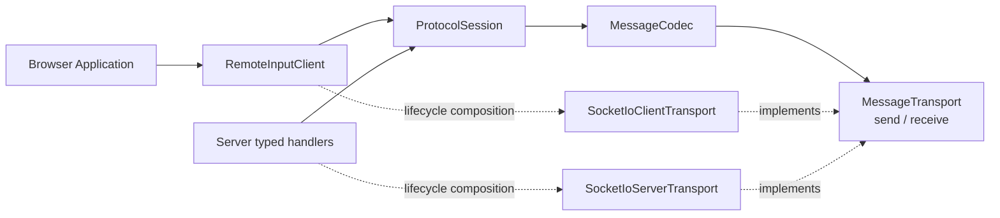
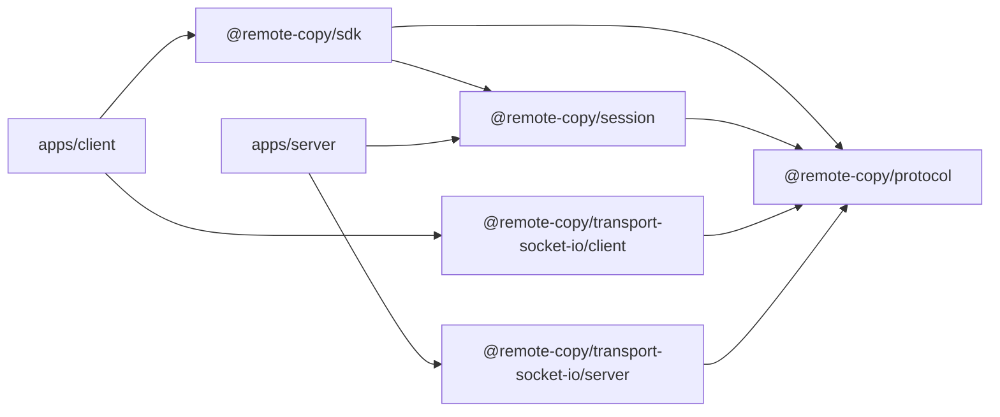
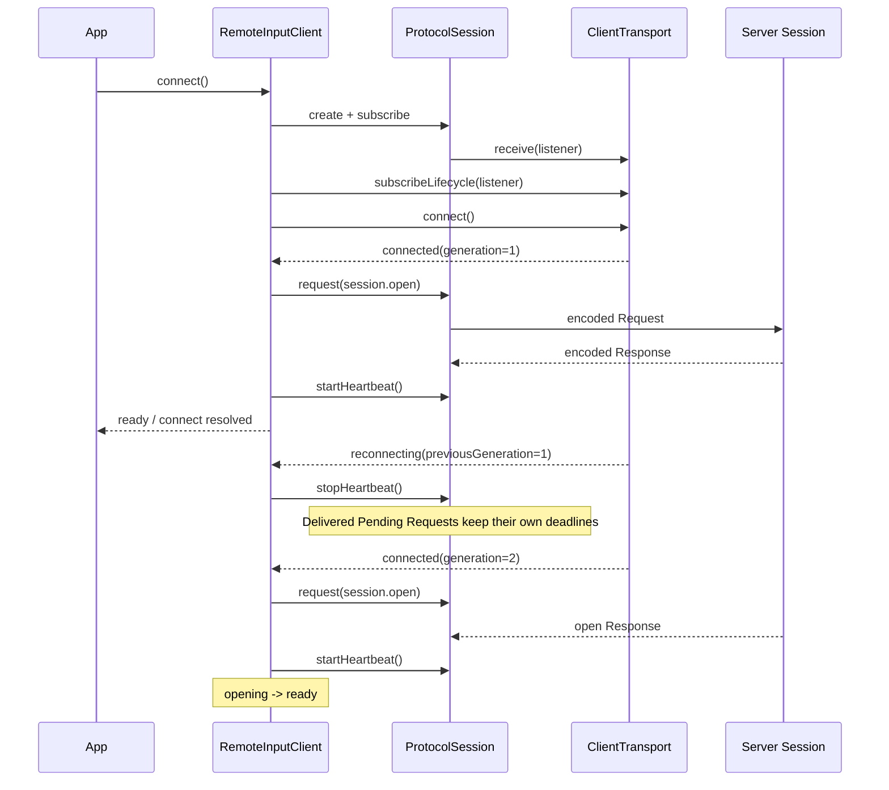
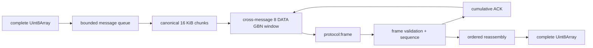

# Architecture Spine - Remote Copy Client、Session 与 Transport

## Design Paradigm

采用**分层端口-适配器架构（Layered Ports and Adapters）**。产品公开责任保持为 SDK 应用层、Session 层和 Transport 层；Codec 是 Session 使用的协议对象/字节转换与不可信输入校验端口，不是调用者操作的第四层。



逻辑数据链固定为：

```text
RemoteInputClient -> ProtocolSession -> MessageCodec -> MessageTransport
```

生命周期控制只存在于 Client/Server 组合根与 Managed Transport 之间；Session 不在该控制路径上。

## Invariants & Rules

### AD-1 - 三个公开责任层与 Codec 内部端口 [ADOPTED]

- **Binds:** FR-1 至 FR-3、FR-13、FR-15，SDK、Session、Codec、Transport 的全部实现。
- **Prevents:** Transport 解析业务 JSON、Session 操作 frame、重新创建同时承担协议与传输职责的 Channel。
- **Rule:** SDK 只调用 Session；Session 组合 Codec 与窄 `MessageTransport`；Codec 只转换并校验完整协议消息；Transport 只交付完整字节消息并在内部实现链路可靠性。依赖只能向下，具体实例只由 Browser/Server 组合根装配。

### AD-2 - Client 拥有应用语义 [ADOPTED]

- **Binds:** FR-1 至 FR-6、FR-31，`RemoteInputClient`、ready、Operation 视图和 SDK 错误。
- **Prevents:** SDK 选择具体 Transport、Session 变成 `inputText` 专用类、UI 直接构造协议 envelope。
- **Rule:** Client 构造时接收调用者创建的一个 `ClientTransport`；公开 `connect`、`disconnect`、`inputText`、状态/Notification/Operation 查询与订阅。它在发送前创建或复用 `operationId`，再调用 `session.request("input.submit", ...)`。不保留 `sendInput`、URL 参数或 Transport factory 兼容 API。

### AD-3 - Session 是业务无关的协议编排器 [ADOPTED]

- **Binds:** FR-7 至 FR-14，`ProtocolSessionContract` 及两端组合。
- **Prevents:** Session 管理连接、读取 Transport state、拥有消息队列或把 request-local failure 广播成全局状态。
- **Rule:** Session 只公开 `request`、`notify`、`handleRequest`、`subscribeNotification`、`subscribeError`、`startHeartbeat`、`stopHeartbeat` 和 `dispose`；没有 `connect`、`disconnect`、`state`、`transport` 或 Transport lifecycle event。构造时同步占用唯一 receiver，dispose 时释放。构造依赖固定为 `MessageTransport`、可选 `MessageCodec`、`createRequestId`、`createHeartbeatId`；配置名固定为 `responseTimeoutMs`、`maxPendingRequests`、`maxConcurrentHandlers`、`heartbeatIntervalMs`、`pongTimeoutMs`。默认最多同时执行 128 个入站 Request handler；容量外的新 Request 不执行 handler，并返回可重试的 `request.capacity-exhausted`。

  Heartbeat 不隐式启动，同一 Session 最多等待一个 Pong；默认 interval 为 15 秒、Pong timeout 为 10 秒。Pong timer 只在对应 Ping 的 Transport Delivery 后启动。`stopHeartbeat` 递增 run epoch，使旧 send callback、timer 和迟到 Pong 失效；heartbeat timeout 只停止当前 run 并发布 `heartbeat-timeout`，不批量完成普通 Pending，也不操作 Transport。

### AD-4 - Pending Request 的首个终态胜出 [ADOPTED]

- **Binds:** FR-7 至 FR-11，所有 `session.request()`。
- **Prevents:** Response 串线、早到 Response 丢失、迟到 callback 反转结果和 Session 二次排队。
- **Rule:** Session 在调用 `send` 前登记 Pending；并发 Request 分别立即调用 `send`。Response、send rejection、Response timeout、dispose 中最先发生者唯一完成 entry。Response 可早于 send resolve；只有 send 已 resolve 且 entry 仍 pending 时才启动 Response timer。Transport lifecycle 对 Session 不可见，已 Delivery 的 Request 在意外断线后继续等待自身 deadline。默认 `responseTimeoutMs=10000`，允许整数 `1000..120000`；默认最多 128 个 Pending。

### AD-5 - Codec 是不可信输入边界 [ADOPTED]

- **Binds:** FR-7、FR-12、FR-13、FR-30，所有线上协议消息。
- **Prevents:** `JSON.parse(...) as ProtocolMessage`、错误 method schema 被当作可信对象、Transport 依赖应用协议。
- **Rule:** `encode` 生成一条完整 `Uint8Array`；`decode` 校验 UTF-8、JSON、协议版本、envelope、Request/Notification body 与 ProtocolError。成功 Response body 保持 `unknown`，Session 先匹配 Pending method，再按该 method 校验 result。

### AD-6 - Transport 数据面与生命周期面分离 [ADOPTED]

- **Binds:** FR-14、FR-15、FR-20、FR-28，所有 Transport contracts 与测试替身。
- **Prevents:** Session 消费 state/error/message 联合、主动端和 accepted 端被迫实现同一生命周期、两个 Session 竞争一个 receive stream。
- **Rule:** `MessageTransport` 恰好只有 `send` 与 message-only `receive`。`ClientTransport` 增加 `kind/state/getLifecycleSnapshot/subscribeLifecycle/connect/disconnect`；`ServerTransport` 增加相同观察与关闭能力但没有主动 `connect`。receive 只交付具有稳定所有权的完整字节，最多一个 active receiver，同步注册、不回放历史、取消幂等。lifecycle 订阅同步首发当前 immutable snapshot，后续只在内部状态已写入后发布。

  新 `send` 只在 `connected` 接受；`idle/connecting/reconnecting/disconnected/error` 均立即拒绝为 `not-delivered`。Client Transport `connect` 在 connected 时幂等成功，在 connecting/reconnecting 时加入当前 single-flight，在 idle/disconnected/error 时启动新周期。`disconnect` 幂等；它先同步线性化 explicit-stop intent，从该时刻起所有新 send 即使尚未发布 snapshot 也立即 `not-delivered`；随后以 `connect-cancelled` 拒绝 connect waiter，取消 connect/recovery、Socket listener 和 timer，终结未完成 send，且在 Promise resolve 前写入并发布 `disconnected`。清理期间的新 connect 与 lifecycle listener 内重入的 connect/disconnect 进入同一 FIFO transition queue；旧 callback 由 lifecycle epoch 丢弃。

### AD-7 - 完整消息发送与 Transport Delivery [ADOPTED]

- **Binds:** FR-15 至 FR-23，每个 `send` Promise、队列与窗口。
- **Prevents:** 上层依赖 chunk、公开 `sendBatch`、把 ACK 当成 Response、reject 后继续发送。
- **Rule:** `send(Uint8Array)` 每次提交一条完整消息；Transport 统一管理并发队列、背压和跨消息发送窗口，并保持提交顺序与消息边界。只有整条消息全部 DATA 获得累计 ACK 才 resolve。reject 是该本地调用的永久终态，之后不得为该消息发送任何新 DATA；ACK 不表示协议 Response 或 Operation 完成。

### AD-8 - Socket.IO 可靠消息适配器 [ADOPTED]

- **Binds:** FR-24 至 FR-28，Socket.IO Client/Server wire、GBN 和资源限制。
- **Prevents:** 双端 frame 漂移、非 canonical 分片、Socket.IO 默认缓冲或恢复复活旧消息。
- **Rule:** 双端只使用二进制 `protocol:frame`，共享同一私有 wire/controller 实现。DATA 是 28-byte 大端 header 加 payload；ACK 固定 8 bytes，是绕过 DATA window 且不再被 ACK 的累计确认。每方向的 `frameSeq/messageId/nextExpectedFrameSeq` 在每个 generation 从 0 独立递增、不得回绕；DATA `frameSeq` 最大 `0xfffffffe`，`0xffffffff` 只用于最终累计 ACK。Socket.IO event ACK、offline buffer 与 connection-state recovery 均不构成本产品保证。

  每个 Client Connection Generation 必须创建全新的 Socket.IO Socket 与 Manager，禁用 Socket.IO 内建 reconnection、event retries 和 connection-state recovery；generation 终止时移除全部 listener、丢弃该对象及其 `sendBuffer`，不得复用于下一代。产品级恢复只由 AD-9 的 Transport loop 创建新对象；Server 每个 accepted Socket 天然对应单独 generation。

### AD-9 - 显式连接周期与 Connection Generation [ADOPTED]

- **Binds:** FR-4 至 FR-6、FR-19、FR-20、FR-27、FR-28，Client/Transport 状态机与异步竞态。
- **Prevents:** 每代重建 Transport、Session 感知重连、旧 Socket/open callback 覆盖当前状态、显式关闭后自动拉起。
- **Rule:** Client 终身持有一个注入的可复用 Transport；每个显式 Client connection cycle 创建一个新 Session，cycle 内的全部自动 Transport generation 共用该 Session 与 receiver。connected generation 是从 1 开始、在 Transport 实例内单调且不复用的正整数；Client 对每代恰好执行一次 `session.open`，仅 open 成功后进入 ready。

  Client `connect()` 的应用 ready 总期限默认 30 秒；其中初次 Transport connect 只有一次、最多 10 秒，剩余预算覆盖 `session.open`。已经成功连接后，意外断线或 connection-fatal 直接进入 `reconnecting`，不先发布终态 `disconnected/error`；恢复最多 3 次、总计 30 秒，尝试前延迟固定为 `[0, 1000, 3000]` ms，单次最多 10 秒并截断到总预算剩余时间。预算耗尽才进入 `error`。Client 观察到 Transport 离开 connected 时立即清 ready、停止 heartbeat；`connecting/reconnecting` 的新 send 立即 `not-delivered`。显式 disconnect 依次停止 heartbeat、同步 dispose 当前 Session、再关闭 Transport，并抑制恢复；后续 connect 在同一 Transport 上创建新 Session。

  Client connect 在 connecting/opening/reconnecting 时加入当前 readiness Promise，ready 时幂等成功，disconnecting 时排队，error 时先 dispose 旧 Session再开启新 cycle。`session.open` 的 ProtocolError、invalid result 或 readiness deadline 失败都必须清 ready、停止 heartbeat、以显式 Transport disconnect 关闭当前 generation 并抑制其自动恢复，再进入 Client error 和 reject readiness。初次 open 失败在关闭前立即 dispose；已 ready 后的新代 open 失败保留 Session，使已 Delivery Request 继续等待 deadline，直到后续显式 disconnect/connect dispose。恢复预算耗尽同样进入 error 而不因 lifecycle 立即 dispose。所有异步写入必须同时匹配 `clientCycleId + generation`。

  `session.open` 的 `transport-send-failed` 必须先检查其结构化 cause：`scope="connection-generation"` 表示该 generation 已由 Transport 终结，Client 不执行显式 disconnect，也不把自动恢复误判为 open failure，而是让 lifecycle snapshot 决定进入下一 generation 或 recovery-exhausted；`scope="call"` 且 generation 仍 connected 才按本代 open failure 关闭 generation。该规则不依赖 send rejection 与 lifecycle fanout 的先后顺序。

### AD-10 - 标识符命名空间隔离 [ADOPTED]

- **Binds:** FR-7、FR-12、FR-27、FR-31，协议、Session、Operation 与 wire。
- **Prevents:** requestId 被当作业务幂等键、heartbeat 串配 Request、Transport 序号泄漏上层。
- **Rule:** `requestId` 只关联一次 Request/Response，且同一 Session 生命周期不复用；`operationId` 关联长期业务幂等；`heartbeatId` 只关联 Ping/Pong；`messageId/frameSeq/nextExpectedFrameSeq` 只属于 Transport generation。入站重复 Request 在 active 期间或默认最多 1024 条、最长 10 分钟的 tombstone 窗口内返回 `request.duplicate`，不再次执行 handler；有限 tombstone 不替代发送方 ID 不复用约束。

### AD-11 - Client/Server 共用同一 Session 契约 [ADOPTED]

- **Binds:** FR-3、FR-12、FR-24、FR-28、FR-29，Browser SDK 与 Server composition。
- **Prevents:** Server 自行解析 JSON、拼 Response 或实现另一套 request correlation。
- **Rule:** Client 通过 Session 发 Request、收 Notification；Server 为每个 accepted Socket 同步创建一个已 connected 的 `ServerTransport + ProtocolSession`，注册 typed handlers 并通过 Session 发 Notification。Server Transport 初始 `generation=1`，结束后不恢复旧 Socket；新 Client Socket 得到新的 Transport/Session。双方共享同一 definitions、Codec 与 Session 行为，Server 不依赖 SDK。

  当前 Client 在每代 open 后启动 heartbeat；Server 总是响应合法 Ping。任何直接组合 Session 的 Server 若显式启动 heartbeat，收到当前 run 的 `heartbeat-timeout` 后必须关闭当前 accepted Server Transport；它不得尝试恢复该 Socket。

### AD-12 - 跨层结构化错误与清理 [ADOPTED]

- **Binds:** FR-10 至 FR-12、FR-19 至 FR-23、FR-31，Transport、Session、SDK 错误和资源终态。
- **Prevents:** 使用 message string 或跨包 `instanceof` 控制流、混淆连接失败与消息交付、一个 Request 失败清空其他 Pending。
- **Rule:** 每个 send rejection 是结构化 `TransportSendError { kind:"transport-send", code, scope:"call"|"connection-generation", delivery:"not-delivered"|"delivery-unknown", cause? }`；lifecycle 使用独立 `TransportLifecycleError`。Session request rejection 使用 `SessionRequestError`，只完成对应调用；`subscribeError` 只交付 `SessionDiagnosticError`。SDK 使用 `InputTextError` 并保留 `operationId:string|null` 与 cause；只有 ID 创建前允许 null。`delivery-unknown` 从不标记为安全自动重试。

  Session dispose 是同步、幂等的本地终态：取消 receive、使 heartbeat/handler callback 失效、清 timer 并以 `session-disposed` 拒绝剩余 Pending，但不调用 Transport，也不能撤回已经交给 Transport 的字节。若必须停止交付，组合根随后 disconnect Transport；已发 DATA 的结果仍可能是 `delivery-unknown`。Transport generation-fatal 必须原子清空队列、窗口、重组和 timer，并逐 send 按是否可能发出 DATA 分类结果。

### AD-13 - 四包独立发布边界 [ADOPTED]

- **Binds:** FR-1、FR-3、FR-29、FR-30、FR-32，package ownership、exports 与版本兼容。
- **Prevents:** SDK/Session 与具体 Transport 绑版、Server 继承 Socket.IO Client 实现、双端 wire 分包漂移、相同 major 静默不兼容。
- **Rule:** 公共包固定为：
  - `@remote-copy/protocol`：root 与 `/definitions` 只导出类型、常量和 ports；`/implementations` 只导出 validation、`JsonMessageCodec` 和结构化 guards；不包含 Session 或具体 Transport。
  - `@remote-copy/session`：root 导出 `ProtocolSession`、`ProtocolRequestError`、Session errors/guards，并必须从 protocol 重导出 Server handler 所需的 `protocolVersion`、method/body/result maps、Notification 和 handler types；不得重定义。
  - `@remote-copy/transport-socket-io`：只开放 `./client` 与 `./server`；共享 frame/GBN core 私有，根入口不聚合双端 runtime，两个子路径不得交叉 import。
  - `@remote-copy/sdk`：root 导出 `RemoteInputClient`、`InputTextError` 与应用类型，不依赖具体 Transport。

  Browser 直接安装 `@remote-copy/sdk` 与 `@remote-copy/transport-socket-io`，并从后者的 `/client` subpath 导入；Server 直接安装 `@remote-copy/session` 与同一个 Transport package，并从 `/server` subpath 导入。内部边全部是普通 `dependencies`，不使用内部 `peerDependencies`：SDK -> protocol + session，Session -> protocol，Socket.IO Transport -> protocol；workspace 使用 `workspace:^` 并在发布后变成同 major caret。Socket.IO client/server runtime 也是 Transport 的普通 dependency。相同 major 的 minor/patch 必须对既有 envelope、method schema 和 DATA/ACK wire 双向兼容；breaking schema/wire 变化同时提升 package major 与协议版本或 `frameVersion`，未知版本确定性失败。CI 使用 golden fixtures 验证当前格式和该 major 最低支持格式；Browser bundle 必须证明不含 Server runtime。

### AD-14 - Operation 视图归 SDK 所有 [ADOPTED]

- **Binds:** FR-2、FR-31，Operation cache、查询和订阅。
- **Prevents:** UI、Session 与 SDK 维护冲突快照，optimistic 状态污染权威 revision。
- **Rule:** SDK OperationStore 是应用层权威快照的唯一所有者，只应用 `incoming.revision > cached.revision` 且状态迁移合法的更新；本地 optimistic 投影不得写入带 revision 的权威缓存。未知 operation 的首个合法 snapshot 可处于任一公共 state；已有 `accepted` 可转到更高 revision 的 accepted/processing/succeeded/failed，已有 `processing` 可转到更高 revision 的 processing/succeeded/failed，succeeded/failed terminal 后不再迁移。`subscribeOperation` 有缓存时同步首发，再只投递成功应用的更新。内部 Transport reconnect 不清缓存；显式 disconnect 后快照只读保留，下一显式 connection cycle 开始时清空。最多 1000 条，优先淘汰最旧 terminal；没有可淘汰项时拒绝新增未知 operation，并通过 `subscribeState` 发布 `operation-cache-full`。

### AD-15 - 运行与安全拓扑不变 [ADOPTED]

- **Binds:** 本次部署、环境与运维范围。
- **Prevents:** 分层重构意外引入服务、数据库、蓝牙模拟或被误认为公网安全方案。
- **Rule:** 运行拓扑仍为 Browser 连接单一 Node/Socket.IO Server，Server 同时托管静态资源；本次只改变 monorepo package 和进程内组合边界。当前运行假设是受信任的本机/LAN，不是公网安全边界；公网暴露前必须重新评审 TLS、认证、Origin allowlist、rate limiting 与审计。

### AD-16 - Operation 公共状态语义 [ADOPTED]

- **Binds:** FR-31，SDK、协议、Server 和 UI。
- **Prevents:** 下游阶段污染公共 state、把 Transport ACK 或 Request Response 当作长期完成。
- **Rule:** 公共 state 只能是 `accepted | processing | succeeded | failed`；`stage` 只表示当前下游专属阶段；`succeeded` 只表示当前协议下游完成自身职责。每个权威更新携带严格递增 revision；terminal 后不得再迁移。Transport ACK 与 Request Response 都不能生成 Operation terminal state。

### AD-17 - 订阅先于可能产生通知的请求 [ADOPTED]

- **Binds:** FR-5、FR-8、FR-12、FR-31，`session.open`、`input.submit` 与通知路由。
- **Prevents:** Response 前到达的 `session.peers` 或 `operation.status` 丢失。
- **Rule:** Client 创建 Session 时先安装 Notification/error 订阅，再开始 Transport connect/open。当前 generation 的 peers 可在 open Response 前缓存；inputText Response 前到达的 operation status 立即按 revision 合并。Session subscription 贯穿同一显式 Client cycle 内的全部 Transport generation，直到 dispose。

### AD-18 - Server Session 与 Operation 生命周期 [ADOPTED]

- **Binds:** FR-3、FR-12、FR-28、FR-31，Server handlers、InputQueue/OperationRegistry 和 subscriber 清理。
- **Prevents:** 重连后相同 `operationId` 重复副作用、job 持有死 Session、状态读取与订阅之间漏更新。
- **Rule:** `input.submit/operation.get` 在 `session.open` 前返回 `session.required`；同连接重复 open 幂等。operationId 在 Server 进程生命周期内全局幂等：相同 ID + 相同 text 复用，相同 ID + 不同 text 返回 conflict。首次 claim、text hash 校验、subscriber 绑定和 `accepted/revision=1` 在无 await 临界区完成；状态更新原子递增 revision、替换 snapshot 并取得 subscriber 快照后再通知。

  Operation/job 独立于 Socket：accepted job 断线后继续，Transport 终止只 dispose Session、解绑 subscriber 和移除连接；新连接以相同 ID 查询/重试时重新绑定。最多保留 1000 个 status snapshot，优先淘汰最旧 terminal 且不淘汰 active；另保留最多 100000 个不可淘汰 `operationId + textHash` tombstone。被淘汰状态返回 `operation.expired`，tombstone 满后新 ID 返回 `operation.capacity-exhausted`；Server restart 开启新幂等域。

## Consistency Conventions

| Concern | Convention |
| --- | --- |
| 公开命名 | Facade 为 `RemoteInputClient`；端口为 `MessageTransport/ClientTransport/ServerTransport/MessageCodec/ProtocolSessionContract`；实现为 `ProtocolSession/JsonMessageCodec/SocketIoClientTransport/SocketIoServerTransport`。 |
| Client 状态 | `idle | connecting | opening | ready | reconnecting | disconnecting | disconnected | error`；`opening` 表示 Transport connected 但 `session.open` 未完成，不提供含混的 Client `connected`。 |
| Transport 状态 | `idle | connecting | connected | reconnecting | disconnected | error`；`state` 必须派生自同一 lifecycle snapshot，不能维护第二份状态。 |
| Lifecycle snapshot | `deadlineAt` 是 Unix epoch ms，仅用于观察；内部 budget 使用单调时钟。`attempt` 是从 1 开始、当前正在进行的恢复尝试。 |
| 订阅 | `subscribeLifecycle`、`subscribeState` 同步首发当前 snapshot；`subscribeOperation` 有缓存时同步首发；Notification/Session error 不回放。fanout 按事件开始时的注册顺序快照，取消幂等，listener 异常隔离。 |
| 字节所有权 | Session/Codec/Transport 边界一律使用完整 `Uint8Array`；交付字节不得在 callback 后被 Transport 修改；frame 只存在于具体 Transport 内部。 |
| 错误 | 跨包使用 `kind/code` 与结构化 type guard，包装时保留 `cause`；不得用 message string 或 `instanceof` 作为兼容契约。 |
| 诊断与脱敏 | `cause/stack` 只用于当前进程的显式开发诊断，永不进入协议序列化、默认 UI 文本、持久化或自动日志。库包不直接 `console`；组合根日志只记录 code、ID、generation、大小和时序，不记录 input text、协议 body 或 frame payload。未知 handler 异常对端只收到通用 `request.failed`。 |
| 时间配置 | 所有 timeout/deadline 构造时校验为有限正整数；公共单位统一为毫秒，测试使用可控 clock/timer。 |
| 状态写入 | 每层只能修改自己拥有的状态；所有异步回调使用 cycle/run/generation epoch 防止迟到写入。 |
| 代码注释 | 只解释 wire、时序或所有权中代码无法直接表达的约束，不复述实现。 |

## Stack

以下版本已由当前 manifest、lockfile、运行环境和 Socket.IO 4.x 官方文档核对；本次不引入新技术。

| Name | Version |
| --- | --- |
| TypeScript | 7.0.2 |
| Node.js | 24.15.0 |
| pnpm | 10.0.0 |
| Turborepo | 2.10.4 |
| Socket.IO client/server | 4.8.3 |

Node `24.15.0` 是目标工具链 pin，不只是本机观测值：迁移必须增加 `.node-version`（或等价单一版本文件）并在 root `package.json` 固定 `engines.node=">=24.15.0 <25"`；CI 与发布使用同一 pin。

## Structural Seed

本节只把 AD 中已冻结的边界投影成一次冷启动 shape，不建立第二套语义事实源；若摘要与 AD 冲突，以对应 AD 为准。实现落地后，`@remote-copy/protocol` definitions 与各 package exports 接管具体声明细节，AD 继续约束所有权和完成语义。

### Public Transport Contracts

```ts
export type Unsubscribe = () => void;

export type TransportLifecycleListener = (
  snapshot: TransportLifecycleSnapshot,
) => void;

export interface MessageTransport {
  send(message: Uint8Array): Promise<void>;
  receive(listener: (message: Uint8Array) => void): Unsubscribe;
}

export type TransportState =
  | "idle"
  | "connecting"
  | "connected"
  | "reconnecting"
  | "disconnected"
  | "error";

export type TransportLifecycleSnapshot =
  | { readonly state: "idle"; readonly generation: null }
  | {
      readonly state: "connecting";
      readonly generation: null;
      readonly deadlineAt: number;
    }
  | { readonly state: "connected"; readonly generation: number }
  | {
      readonly state: "reconnecting";
      readonly generation: null;
      readonly previousGeneration: number;
      readonly attempt: number;
      readonly maxAttempts: number;
      readonly deadlineAt: number;
      readonly lastError: TransportLifecycleError;
    }
  | { readonly state: "disconnected"; readonly generation: null }
  | {
      readonly state: "error";
      readonly generation: null;
      readonly error: TransportLifecycleError;
    };

export interface ClientTransport extends MessageTransport {
  readonly kind: string;
  readonly state: TransportState;
  getLifecycleSnapshot(): TransportLifecycleSnapshot;
  subscribeLifecycle(listener: TransportLifecycleListener): Unsubscribe;
  connect(): Promise<void>;
  disconnect(): Promise<void>;
}

export interface ServerTransport extends MessageTransport {
  readonly kind: string;
  readonly state: TransportState;
  getLifecycleSnapshot(): TransportLifecycleSnapshot;
  subscribeLifecycle(listener: TransportLifecycleListener): Unsubscribe;
  disconnect(): Promise<void>;
}
```

### Error Contracts

```ts
export type TransportLifecycleError = Error & {
  readonly kind: "transport-lifecycle";
  readonly code:
    | "connect-timeout"
    | "connect-failed"
    | "connection-lost"
    | "invalid-frame"
    | "reassembly-timeout"
    | "retransmission-exhausted"
    | "sequence-exhausted"
    | "connect-cancelled"
    | "internal";
  readonly cause?: unknown;
};

export type TransportSendErrorCode =
  | "not-connected"
  | "message-too-large"
  | "queue-full"
  | "connection-ended"
  | "invalid-frame"
  | "reassembly-timeout"
  | "retransmission-exhausted"
  | "sequence-exhausted"
  | "internal";

export type TransportSendError = Error & {
  readonly kind: "transport-send";
  readonly code: TransportSendErrorCode;
  readonly scope: "call" | "connection-generation";
  readonly delivery: "not-delivered" | "delivery-unknown";
  readonly cause?: unknown;
};

export type SessionRequestError = Error & {
  readonly kind: "session-request";
  readonly code:
    | "transport-send-failed"
    | "response-timeout"
    | "remote-error"
    | "invalid-response"
    | "pending-capacity"
    | "session-disposed";
  readonly method: ProtocolMethod;
  readonly requestId: string | null;
  readonly cause?: unknown;
};

export type SessionDiagnosticError = Error & {
  readonly kind: "session-diagnostic";
  readonly code:
    | "invalid-message"
    | "unknown-response"
    | "unknown-pong"
    | "handler-failed"
    | "heartbeat-send-failed"
    | "heartbeat-timeout";
  readonly cause?: unknown;
};

export type SessionDiagnosticErrorListener = (
  error: SessionDiagnosticError,
) => void;

export type InputTextErrorCode =
  | "input-empty"
  | "input-too-large"
  | "not-ready"
  | "unsupported"
  | "busy"
  | "not-delivered"
  | "delivery-unknown"
  | "response-timeout"
  | "remote-error"
  | "invalid-response"
  | "session-disposed";

export type InputTextError = Error & {
  readonly kind: "input-text";
  readonly code: InputTextErrorCode;
  readonly operationId: string | null;
  readonly cause?: unknown;
};

export type ClientConnectError = Error & {
  readonly kind: "client-connect";
  readonly code:
    | "connect-timeout"
    | "transport-failed"
    | "session-open-failed"
    | "recovery-exhausted"
    | "connect-cancelled";
  readonly cause?: unknown;
};

export type ClientDiagnosticError = Error & {
  readonly kind: "client-diagnostic";
  readonly code:
    | "connect-timeout"
    | "transport-failed"
    | "recovery-exhausted"
    | "session-open-failed"
    | "heartbeat-timeout"
    | "invalid-message"
    | "remote-error"
    | "operation-cache-full";
  readonly cause?: unknown;
};
```

错误映射固定为：

| Source | `InputTextError.code` | Preservation |
| --- | --- | --- |
| 输入校验、Client 未 ready、能力不支持、输入 busy | 对应 `input-* / not-ready / unsupported / busy` | ID 创建前 `operationId=null` |
| `SessionRequestError(transport-send-failed)` | 从其结构化 `TransportSendError` cause 原样映射 `delivery` 为 `not-delivered` 或 `delivery-unknown` | 保留 Session 与 Transport error cause 链 |
| `SessionRequestError(response-timeout)` | `response-timeout` | 保留 method/requestId cause |
| `SessionRequestError(remote-error)` | `remote-error` | 保留已校验 ProtocolError 的 code/message/retryable |
| `SessionRequestError(invalid-response)` | `invalid-response` | 保留 validation cause |
| `SessionRequestError(session-disposed)` | `session-disposed` | 保留 Session cause |
| `SessionRequestError(pending-capacity)` | `not-delivered` | cause 仍标记 pending-capacity |

`client.connect()` 只以 `ClientConnectError` reject：30 秒 readiness 总期限映射 `connect-timeout`，初次 Transport failure 映射 `transport-failed`，open ProtocolError/validation 映射 `session-open-failed`，恢复预算耗尽映射 `recovery-exhausted`，显式 disconnect 取消映射 `connect-cancelled`。除 intentional `connect-cancelled` 外，同一 cause 写入 `RemoteInputState.error` 的对应 `ClientDiagnosticError`；显式取消最终必须是 `connectionState="disconnected"` 且 `error=null`。不得直接向 SDK 调用者泄漏 Socket.IO error。

Ping 的 generation-scope send failure 终止当前 heartbeat run，恢复由 Transport lifecycle 驱动；call-scope capacity failure 不启动 Pong timer，并在下个 interval 再试。只有匹配当前 cycle 与 generation 的 `heartbeat-timeout` 触发 Client 串行 `transport.disconnect() -> transport.connect()`。Server 组合根对该 timeout 关闭 accepted Transport。Session 不批量完成普通 Pending Request。

### Public Session And Client Shape

```ts
export type ProtocolSessionOptions = {
  readonly codec?: MessageCodec;
  readonly createRequestId?: IdFactory;
  readonly createHeartbeatId?: IdFactory;
  readonly responseTimeoutMs?: number;
  readonly maxPendingRequests?: number;
  readonly maxConcurrentHandlers?: number;
  readonly heartbeatIntervalMs?: number;
  readonly pongTimeoutMs?: number;
};

export declare class ProtocolSession {
  constructor(transport: MessageTransport, options?: ProtocolSessionOptions);
}

export interface ProtocolSessionContract {
  request<M extends ProtocolMethod>(
    method: M,
    body: ProtocolRequestMap[M],
  ): Promise<ProtocolResultMap[M]>;

  notify<N extends ProtocolNotificationName>(
    name: N,
    body: ProtocolNotificationMap[N],
  ): Promise<void>;

  handleRequest<M extends ProtocolMethod>(
    method: M,
    handler: ProtocolRequestHandler<M>,
  ): Unsubscribe;

  subscribeNotification(listener: ProtocolNotificationListener): Unsubscribe;
  subscribeError(listener: SessionDiagnosticErrorListener): Unsubscribe;
  startHeartbeat(): void;
  stopHeartbeat(): void;
  dispose(): void;
}

export type ClientConnectionState =
  | "idle"
  | "connecting"
  | "opening"
  | "ready"
  | "reconnecting"
  | "disconnecting"
  | "disconnected"
  | "error";

export type RemoteInputState = Readonly<{
  connectionState: ClientConnectionState;
  transportKind: string;
  transportLifecycle: TransportLifecycleSnapshot;
  peer: PeerInfo | null;
  capabilities: ProtocolCapabilities | null;
  peers: readonly PeerSummary[];
  currentOperation: OperationStatus | null;
  isSubmitting: boolean;
  error: ClientDiagnosticError | null;
}>;

export type RemoteInputStateListener = (state: RemoteInputState) => void;

export class RemoteInputClient {
  constructor(transport: ClientTransport, options?: RemoteInputClientOptions);
  connect(): Promise<void>;
  disconnect(): Promise<void>;
  inputText(
    text: string,
    options?: { operationId?: string },
  ): Promise<{ operationId: string }>;
  getState(): RemoteInputState;
  subscribeState(listener: RemoteInputStateListener): Unsubscribe;
  subscribeNotification(listener: RemoteInputNotificationListener): Unsubscribe;
  getOperationStatus(operationId: string): OperationStatus | null;
  refreshOperationStatus(operationId: string): Promise<OperationStatus>;
  subscribeOperation(
    operationId: string,
    listener: OperationStatusListener,
  ): Unsubscribe;
}
```

### Inbound Request Mapping

| Input | Required Session behavior |
| --- | --- |
| 未注册 method | 使用相同 `requestId` 返回 `method.unsupported` |
| Handler 抛出 `ProtocolRequestError` | 原样返回其已校验 ProtocolError |
| Handler 抛出其他错误 | 使用相同 `requestId` 返回不可重试的 `request.failed` |
| 已有 128 个 handler 执行中 | 不执行新 handler，返回可重试的 `request.capacity-exhausted` |
| Active 或 tombstone 窗口内的重复 Request | 不再次执行 handler，返回 `request.duplicate` |
| 未知、重复或迟到 Response/Pong | 只发布对应 diagnostic，不匹配任何调用 |
| Codec 校验失败 | 不调用 handler，不从不可信字段构造 Response，只发布 `invalid-message` |

### Package Dependency Graph



### Connection And Recovery Sequence



### Socket.IO Transport Pipeline



| Wire/limit | Fixed value |
| --- | --- |
| DATA | 28-byte big-endian header + payload |
| ACK | 8-byte big-endian cumulative `nextExpectedFrameSeq` |
| Chunk payload | 16 KiB |
| DATA window | 8 frames, may cross message boundaries |
| ACK timeout | 2 s |
| Retransmission | Initial send + at most 3 Go-Back-N rounds |
| Reassembly no-progress timeout | 10 s |
| Complete message | 256 KiB maximum |
| Send queue | 128 messages and 4 MiB, including queued and awaiting-ACK messages |

Canonical DATA fields are:

```text
u16 magic = 0x5243
u8  frameVersion = 1
u8  kind = 1
u32 frameSeq
u32 messageId
u32 chunkIndex
u32 chunkCount
u32 totalMessageBytes
u32 payloadBytes
payload
```

ACK fields are:

```text
u16 magic = 0x5243
u8  frameVersion = 1
u8  kind = 2
u32 nextExpectedFrameSeq
```

`chunkCount=max(1,ceil(totalMessageBytes/chunkPayloadBytes))`。除末片外 payload 必须等于 chunk payload；末片必须等于剩余字节；空消息编码为一个零 payload DATA frame。只有累计 ACK 或接收端期望序号严格推进才重置对应 timeout；重复/回退 ACK 与重复/越序 DATA 不构成 progress。

### Target Source Ownership

```text
packages/
  protocol/
    src/definitions/              # messages, ports, constants, error shapes
    src/implementations/          # validation, JsonMessageCodec, guards
  session/
    src/                          # ProtocolSession, IDs, Session errors
  transport-socket-io/
    src/shared/                   # private frames, GBN, queue, reassembly
    src/client/                   # active ClientTransport
    src/server/                   # accepted ServerTransport
  sdk/
    src/                          # RemoteInputClient, state, OperationStore, errors
apps/
  client/                         # creates ClientTransport and injects SDK
  server/                         # accepts Socket, creates ServerTransport + Session
```

共享 wire/controller 不从 Transport package exports 暴露。SDK 的 state/Operation stores 不从 SDK root 单独导出。应用协议 definitions 只能在 protocol package 定义一次；其他包只重导出或消费。

### Atomic Migration Order

1. 创建 Session 与 Socket.IO Transport packages、exports、root scripts，并在 protocol 中先落地 ports/error contracts；root `test:protocol` 依次运行 `@remote-copy/protocol`、`@remote-copy/session`、`@remote-copy/transport-socket-io` 的 package tests，并聚合 golden fixtures、exports 隔离和 Browser bundle 边界检查，继续与 `test:sdk`、`test:server` 构成仓库门禁。
2. 移出共享 Socket.IO wire/controller，完成 data/lifecycle split、generation、恢复和 failure finality。
3. 移出 ProtocolSession，改为 message-only port、独立订阅、heartbeat run epoch 与 dispose。
4. 将 SDK 改为 Transport instance injection、每显式 cycle 新 Session、`inputText`、新状态与错误。
5. 迁移 Server accepted-Socket composition、全局 OperationRegistry，再迁移 Browser composition。
6. 迁移归属测试、exports tests、workspace TypeScript/build graph、root test 聚合、README、`docs/architecture.md`、`docs/implementation-plan.md` 与 `AGENTS.md`。现有真实 Socket.IO Server 测试改为只发 `session.open`；`input.submit`、全局 operation 去重与 subscriber rebind 移到 message-only in-memory Transport 和无 OS 副作用 handler 的测试。
7. 在同一原子变更中删除旧 factory、`sendInput`、Session lifecycle API、Transport event-union subscribe 和旧 implementation exports；不发布 alias、adapter 或运行时双接口探测。

## Capability -> Architecture Map

| Capability / Area | Lives in | Governed by |
| --- | --- | --- |
| FR-1 至 FR-6 Client composition/readiness | `@remote-copy/sdk` | AD-2、AD-9、AD-17 |
| FR-7 至 FR-14 Session/Codec | `@remote-copy/session`、`@remote-copy/protocol` | AD-3 至 AD-5、AD-10、AD-12 |
| FR-15 至 FR-23 complete-message transport | protocol ports、Transport implementations | AD-6、AD-7、AD-9、AD-12 |
| FR-24 至 FR-28 Socket.IO | `@remote-copy/transport-socket-io` | AD-8、AD-9、AD-11 |
| FR-29、FR-30、FR-32 publishing/migration | all packages/apps | AD-1、AD-13 |
| FR-31 Operation semantics | SDK、Server OperationRegistry | AD-2、AD-10、AD-12、AD-14、AD-16、AD-18 |
| Operational/security envelope | Browser + single Node Server | AD-15、Deferred |

## Verification Contract

| Area | Required proof |
| --- | --- |
| Protocol/Codec | 全部 message kind、非法 UTF-8/JSON/envelope/body、成功 result 按 pending method 校验、exports 隔离、同 major golden fixtures。 |
| Session | 仅使用 message-only fake；pending-before-send、并发/逆序/早到 Response、delivery 后计时、first-wins、ID 不复用、重复 Request tombstone、128 handler 上限、独立订阅、heartbeat run 隔离、dispose 与迟到 handler。 |
| Transport wire | 精确 DATA/ACK bytes、canonical 空/单/多分片、双向顺序与边界、跨消息 window、累计 ACK、ACK bypass、重复/越序不算 progress。 |
| Transport failure | call-local/generation-fatal、not-delivered/delivery-unknown、reject 后零新增 DATA、资源上限、序号不回绕、旧 Socket/offline buffer 不复活。 |
| Transport lifecycle | 同步初始 snapshot、generation 单调、listener 隔离与 FIFO 重入、初连 10 秒、`[0,1s,3s]` 三次/30 秒恢复、恢复期拒绝 send、显式关闭取消、error 后显式再连。 |
| SDK | instance injection、无 concrete Transport import、connect single-flight、opening/ready、每代一次 open、自动恢复复用 Session、显式周期创建新 Session、错误/operationId 恢复、订阅首发与 strict revision。 |
| Server | accepted Transport 无 connect、open gate、typed handlers/Notification、Transport 终止 dispose Session、全局 operationId 去重与 subscriber rebind。 |
| Repository | `pnpm test:protocol` 必须聚合 protocol/session/transport，另运行 `pnpm test:sdk`、`pnpm test:server`、`pnpm check`、`pnpm build`。任何自动化真实 Socket/Server 联调只发 `session.open`，不得发送非空 `input.submit`；输入成功路径通过不连接 OS executor 的直接 handler/fake 测试。 |

## Deferred

- Bluetooth、WebSocket 或其他 Transport 的具体实现；接入时必须实现相同 ports、lifecycle 和 error contract。
- 跨 Connection Generation 的 Session resume、未完成消息 replay 或持久化 delivery。
- DATA/ACK 参数在线协商、压缩、加密与新的 wire major。
- 大规模客户端同时恢复所需的随机 jitter 或集中退避策略；出现集中重连部署前重新评审。
- 跨进程/重启 Operation 持久化与多 Server 共享幂等域；引入水平扩展前重新评审。
- TLS、认证、Origin allowlist、rate limiting 与公网部署；任何公网暴露前必须完成。
- npm registry、provenance、release automation 与长期支持窗口的具体工具；首次非 private 发布前决定。
- UI 布局、输入历史持久化和下游输入执行细节。
