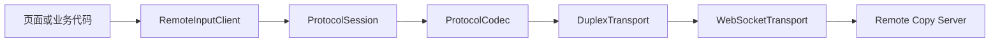
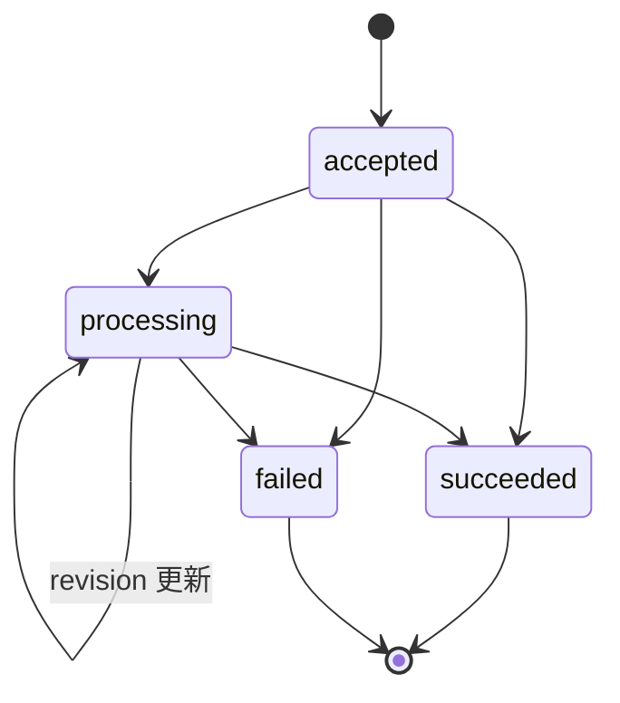

# @remote-copy/sdk

`@remote-copy/sdk` 是 Remote Copy 的 TypeScript SDK。它在可靠、有序、保留消息边界的双工 Transport 上运行统一应用协议，为网页和其他调用方提供连接、远程输入、operation 状态缓存与订阅能力。

当前实现提供 `WebSocketTransport`。SDK 核心不依赖 WebSocket 业务语义，未来可以接入其他 Transport，而不改变 `RemoteInputClient`、请求响应模型或 operation 状态模型。

## 快速开始

```ts
import {
  RemoteInputClient,
  SendInputError,
  WebSocketTransport,
} from "@remote-copy/sdk";

const client = new RemoteInputClient({
  clientName: "网页浏览器",
});

const unsubscribe = client.subscribe((state) => {
  console.log("连接状态：", state.connectionState);
  console.log("当前下游：", state.peer);
  console.log("当前操作：", state.currentOperation);
});

await client.connect(
  new WebSocketTransport("ws://127.0.0.1:17888/ws"),
);

try {
  const { operationId } = await client.sendInput("你好，Remote Copy");
  console.log("下游已接受操作：", operationId);
} catch (error) {
  if (error instanceof SendInputError) {
    console.error(error.code, error.message);
  }
}

unsubscribe();
await client.disconnect();
```

`sendInput()` resolve 只表示当前协议下游已经接受请求并返回 `operationId`，不表示整个操作已经成功完成。最终结果通过 `operation.status` 事件更新。

## 架构

```text
RemoteInputClient
  -> ProtocolSession
    -> ProtocolCodec
      -> DuplexTransport
```



各层职责固定：

- `RemoteInputClient`：远程输入 API、operation 缓存、状态订阅和能力检查。
- `ProtocolSession`：`session.open` 握手、请求响应关联、超时、断线清理和事件分发。
- `ProtocolCodec`：`ProtocolMessage` 与 `Uint8Array` 之间的转换。
- `DuplexTransport`：可靠、有序、保留消息边界的双工传输，不解析业务协议。
- `WebSocketTransport`：当前 WebSocket Transport 实现，只处理连接和字节消息。

统一协议的类型和运行时校验位于 `@remote-copy/shared`，它是协议的唯一事实源。

## RemoteInputClient

### 创建客户端

```ts
const client = new RemoteInputClient({
  clientName: "网页浏览器",
  requestTimeoutMs: 10_000,
});
```

`RemoteInputClientOptions`：

| 字段 | 类型 | 默认值 | 说明 |
| --- | --- | --- | --- |
| `clientName` | `string` | `"Client"` | `session.open` 中报告给下游的名称 |
| `requestTimeoutMs` | `number` | `10000` | 单次协议请求的超时时间 |
| `createRequestId` | `() => string` | SDK 内置生成器 | 自定义 requestId，主要用于测试或特殊运行环境 |

默认 requestId 不依赖 `crypto.randomUUID()`，可以在普通局域网 HTTP 页面中使用。格式为：

```text
request-<base36 时间戳>-<base36 运行时递增序号>
```

requestId 只用于请求响应关联，不是身份凭证或安全令牌。自定义 `createRequestId` 时，必须保证所有未完成请求的 ID 不重复。

### 连接

```ts
await client.connect(
  new WebSocketTransport("ws://192.168.1.10:17888/ws"),
);
```

连接过程包含两个阶段：

1. Transport 建立连接。
2. `ProtocolSession` 发送 `session.open` 并校验响应。

只有两个阶段都成功后，`connect()` 才 resolve，`connectionState` 才会进入 `ready`。

```text
idle -> connecting -> connected -> ready
                         |
                         +-> error / disconnected
```

### 断开

```ts
await client.disconnect();
```

主动断开或 Transport 进入 `disconnected`/`error` 后，SDK 会：

- 拒绝未完成的协议请求；
- 清空当前会话的 `peer`、`capabilities` 和 `peers`；
- 将 `isSubmitting` 恢复为 `false`；
- 保留 operation 缓存和 `currentOperation`，允许断线后本地读取最后状态。

下一次 `connect()` 开始时会清空旧 operation 缓存，建立一个新的会话视图。

### 读取和订阅状态

```ts
const state = client.getState();

const unsubscribe = client.subscribe((nextState) => {
  console.log(nextState.connectionState);
});

unsubscribe();
```

`RemoteInputState`：

| 字段 | 类型 | 说明 |
| --- | --- | --- |
| `connectionState` | `ConnectionState` | Client 当前连接状态 |
| `transportKind` | `string \| null` | 当前 Transport 类型，例如 `websocket` |
| `peer` | `PeerInfo \| null` | 当前协议下游身份 |
| `capabilities` | `ProtocolCapabilities \| null` | 下游声明的方法和事件能力 |
| `peers` | `PeerSummary[]` | 当前会话收到的 peer 列表 |
| `currentOperation` | `OperationStatus \| null` | 最近应用到 Client 的 operation 状态 |
| `isSubmitting` | `boolean` | `input.submit` 请求是否尚未返回 |
| `error` | `RemoteInputError \| null` | 最近一次 Client 级错误 |

`ConnectionState` 可能为：

```ts
type ConnectionState =
  | "idle"
  | "connecting"
  | "connected"
  | "ready"
  | "disconnected"
  | "error";
```

### 发送输入

```ts
const { operationId } = await client.sendInput("需要发送的文本");
```

方法签名：

```ts
sendInput(text: string): Promise<{
  operationId: string;
}>;
```

Client 会在发送前检查：

- 文本不是空白内容；
- 会话已经 `ready`；
- 下游声明支持 `input.submit`；
- 当前没有正在提交或仍处于活动状态的 operation。

失败时抛出 `SendInputError`：

| `code` | 含义 |
| --- | --- |
| `input-empty` | 输入内容为空 |
| `transport-not-ready` | Transport 或协议会话尚未就绪 |
| `input-unsupported` | 下游没有声明 `input.submit` 能力 |
| `input-busy` | 另一个输入操作仍处于活动状态 |
| `request-failed` | 请求超时、传输失败、响应非法或下游返回错误 |

下游错误可以通过 `cause` 继续检查：

```ts
import {
  ProtocolResponseError,
  SendInputError,
} from "@remote-copy/sdk";

try {
  await client.sendInput("文本");
} catch (error) {
  if (
    error instanceof SendInputError &&
    error.cause instanceof ProtocolResponseError
  ) {
    console.error(error.cause.protocolError.code);
    console.error(error.cause.protocolError.retryable);
  }
}
```

### operation 缓存

读取本地缓存不会访问下游：

```ts
const status = client.getOperationStatus(operationId);
```

订阅指定 operation 的后续更新：

```ts
const unsubscribe = client.subscribeOperation(
  operationId,
  (status) => {
    console.log(status.state, status.stage, status.progress);
  },
);
```

`subscribeOperation()` 不会立即重放已有缓存；需要初始值时先调用 `getOperationStatus()`。

主动向下游刷新：

```ts
const status = await client.refreshOperationStatus(operationId);
```

刷新会发送 `operation.get`。正常连接期间应优先使用 `operation.status` 推送，不建议固定间隔轮询。

每个状态都携带递增的 `revision`。SDK 只接受比缓存更新的 revision，避免重复事件或旧响应覆盖新状态。

## operation 状态语义

公共 operation state 只有四种：

```ts
type OperationState =
  | "accepted"
  | "processing"
  | "succeeded"
  | "failed";
```

`OperationStatus`：

```ts
type OperationStatus = {
  operationId: string;
  revision: number;
  state: OperationState;
  stage: string;
  progress: number;
  message: string;
};
```

- `state` 表达跨下游一致的公共状态。
- `stage` 表达下游专属阶段，例如 Server 的 `copying`、`pasting`，或未来其他下游的 `forwarding`。
- `progress` 是 `0` 到 `100` 的有限数字。
- `revision` 是从 `0` 开始的非负整数，并随状态更新递增。
- `succeeded` 表示当前协议下游完成了自身职责，不固定解释为某个最终 Agent 已执行。



## Client 错误状态

`RemoteInputState.error` 使用以下错误码：

| `code` | 含义 |
| --- | --- |
| `transport-connect-failed` | Transport 连接或 `session.open` 失败 |
| `transport-error` | Transport 操作失败或非协议校验类错误 |
| `invalid-message` | 收到非法 UTF-8、非法 JSON 或结构不符合协议的消息 |
| `peer-error` | 下游返回失败 Response |

`state.error` 用于 UI 状态展示；具体 API 调用仍会通过 Promise rejection 报告失败。

## 统一协议

协议包含三类报文：

```ts
type ProtocolMessage =
  | RequestMessage
  | ResponseMessage
  | EventMessage;
```

当前协议版本为 `1`。

### Request

```json
{
  "v": 1,
  "kind": "request",
  "id": "request-lx1-1",
  "method": "input.submit",
  "body": {
    "text": "你好"
  }
}
```

### 成功 Response

```json
{
  "v": 1,
  "kind": "response",
  "id": "request-lx1-1",
  "ok": true,
  "body": {
    "operationId": "operation-123"
  }
}
```

### 失败 Response

```json
{
  "v": 1,
  "kind": "response",
  "id": "request-lx1-1",
  "ok": false,
  "error": {
    "code": "input.rejected",
    "message": "输入请求被拒绝",
    "retryable": false
  }
}
```

### Event

```json
{
  "v": 1,
  "kind": "event",
  "name": "operation.status",
  "body": {
    "operationId": "operation-123",
    "revision": 2,
    "state": "processing",
    "stage": "copying",
    "progress": 35,
    "message": "正在写入剪贴板"
  }
}
```

### 当前方法和事件

| 类型 | 名称 | 用途 |
| --- | --- | --- |
| 方法 | `session.open` | 打开协议会话并交换 peer、版本和能力 |
| 方法 | `input.submit` | 提交输入并获得 `operationId` |
| 方法 | `operation.get` | 获取指定 operation 的当前状态 |
| 事件 | `operation.status` | 推送 operation 状态和递增 revision |
| 事件 | `session.peers` | 推送当前会话可见的 peer 列表 |

### ID 职责

```text
传输分片序号：只属于 Transport
requestId：    只关联一次 Request / Response
operationId：  关联长期 operation 和状态事件
```

Response 使用相同 requestId 结束一次请求。后续 `operation.status` 只携带 operationId，不依赖最初的 requestId。

## ProtocolSession

需要直接使用协议层时，可以跳过 `RemoteInputClient`：

```ts
import {
  ProtocolSession,
  WebSocketTransport,
} from "@remote-copy/sdk";

const session = new ProtocolSession(
  new WebSocketTransport("ws://127.0.0.1:17888/ws"),
  { requestTimeoutMs: 10_000 },
);

session.subscribe((event) => {
  if (event.type === "event") {
    console.log(event.event.name, event.event.body);
  }
});

const info = await session.connect("协议客户端");
const result = await session.request("operation.get", {
  operationId: "operation-123",
});

console.log(info.peer, result.state);
await session.disconnect();
```

`ProtocolSessionOptions`：

| 字段 | 类型 | 默认值 |
| --- | --- | --- |
| `codec` | `ProtocolCodec` | `JsonProtocolCodec` |
| `createRequestId` | `() => string` | SDK 内置生成器 |
| `requestTimeoutMs` | `number` | `10000` |

`session.info` 在握手成功后返回 `SessionOpenResult`。Transport 断开、进入错误状态或主动 `disconnect()` 后，它会恢复为 `null`。

下游失败 Response 会拒绝对应请求并抛出 `ProtocolResponseError`，完整错误位于 `error.protocolError`。

## Codec

默认 `JsonProtocolCodec` 执行：

```text
ProtocolMessage
  -> JSON.stringify
  -> UTF-8
  -> Uint8Array
```

接收方向执行相反转换，并调用 `@remote-copy/shared` 的 `parseProtocolMessage()` 做运行时校验。

非法 UTF-8、JSON 语法错误和协议结构错误都会作为 `ProtocolValidationError` 报告。Client UI 不需要也不应直接解析协议报文。

自定义 Codec 必须实现：

```ts
interface ProtocolCodec {
  encode(message: ProtocolMessage): Uint8Array;
  decode(message: Uint8Array): ProtocolMessage;
}
```

同一会话的双方必须使用相同编码。

## DuplexTransport

Transport 接口：

```ts
interface DuplexTransport {
  readonly kind: string;
  readonly state: TransportState;

  connect(): Promise<void>;
  disconnect(): Promise<void>;
  send(message: Uint8Array): Promise<void>;
  subscribe(listener: TransportListener): () => void;
}
```

`TransportState`：

```ts
type TransportState =
  | "idle"
  | "connecting"
  | "connected"
  | "disconnected"
  | "error";
```

Transport 通过订阅发送三类事件：

```ts
type TransportEvent =
  | { type: "state"; state: TransportState }
  | { type: "message"; message: Uint8Array }
  | { type: "error"; error: unknown };
```

Transport 必须负责：

- 建立和关闭连接；
- 可靠、有序地传递完整消息；
- 保留消息边界；
- 报告连接状态和传输错误；
- 在内部处理传输特有的分片、重组、ACK 和重试。

Transport 不得：

- 解析协议业务 JSON；
- 理解 `session.open`、`input.submit` 或 `operation.status`；
- 创建或修改 operationId；
- 向 `RemoteInputClient` 暴露底层 WebSocket、GATT 或分片细节。

## WebSocketTransport

```ts
const transport = new WebSocketTransport(
  "ws://127.0.0.1:17888/ws",
  { connectTimeoutMs: 10_000 },
);
```

`WebSocketTransportOptions`：

| 字段 | 类型 | 默认值 | 说明 |
| --- | --- | --- | --- |
| `connectTimeoutMs` | `number` | `10000` | WebSocket 建连超时 |
| `createWebSocket` | `(url: string) => WebSocket` | 浏览器 `WebSocket` | 测试或非浏览器环境的工厂 |

实现特性：

- 发送时复制 `Uint8Array` 并使用二进制 WebSocket 消息；
- 接收 `ArrayBuffer`、TypedArray、Blob 和字符串消息并统一转换为 `Uint8Array`；
- Blob 异步转换期间保持原始消息顺序；
- 重连后丢弃旧 socket 尚未完成解码的消息；
- Transport 层不解析 JSON。

## 公共导出

主要运行时导出：

```ts
RemoteInputClient
SendInputError
ProtocolSession
ProtocolResponseError
JsonProtocolCodec
WebSocketTransport
```

主要类型导出：

```text
RemoteInputClientOptions     RemoteInputState
RemoteInputError             ConnectionState
InputSubmission              OperationStatus
OperationState               ProtocolCapabilities
PeerInfo                     PeerSummary
ProtocolCodec                ProtocolSessionOptions
ProtocolSessionEvent         DuplexTransport
TransportState               TransportEvent
WebSocketTransportOptions    WebSocketFactory
```

## 开发与验证

SDK 单独验证：

```bash
pnpm test:sdk
pnpm check:sdk
pnpm build:sdk
```

修改协议或跨 workspace 行为时运行：

```bash
pnpm test:sdk
pnpm check
pnpm build
```

自动验证不得向真实服务发送非空 `input.submit`，避免修改本机剪贴板或触发粘贴。真实联调默认只验证 `session.open`。
