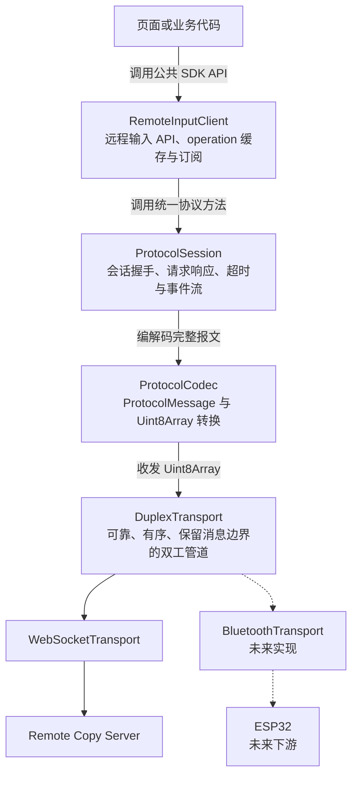
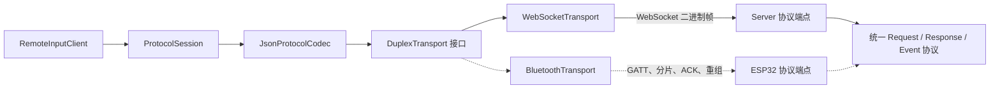
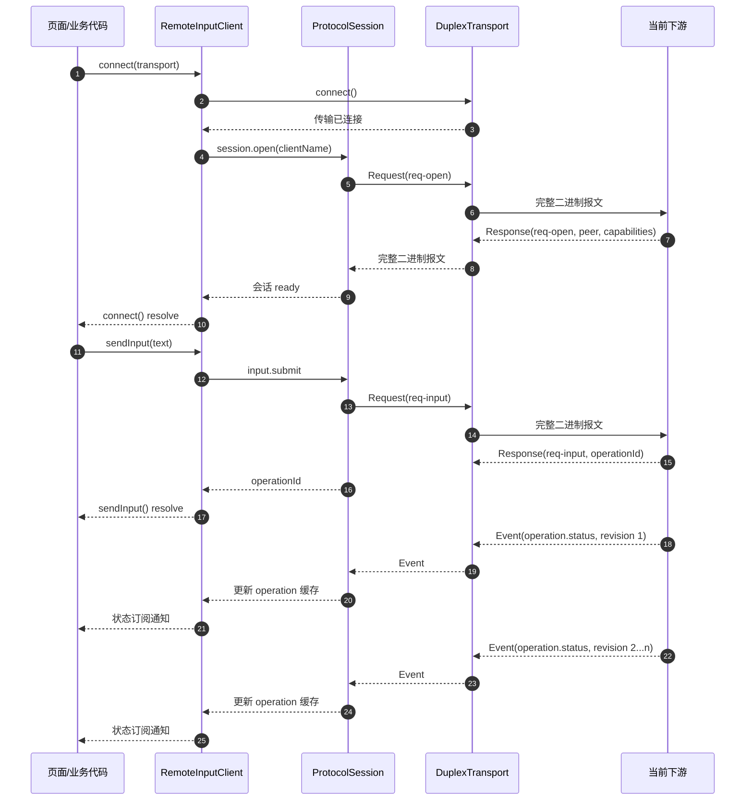
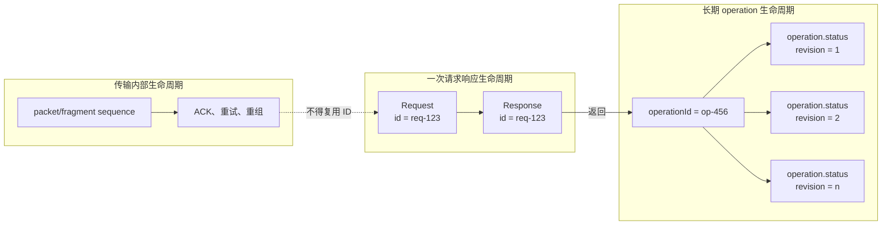
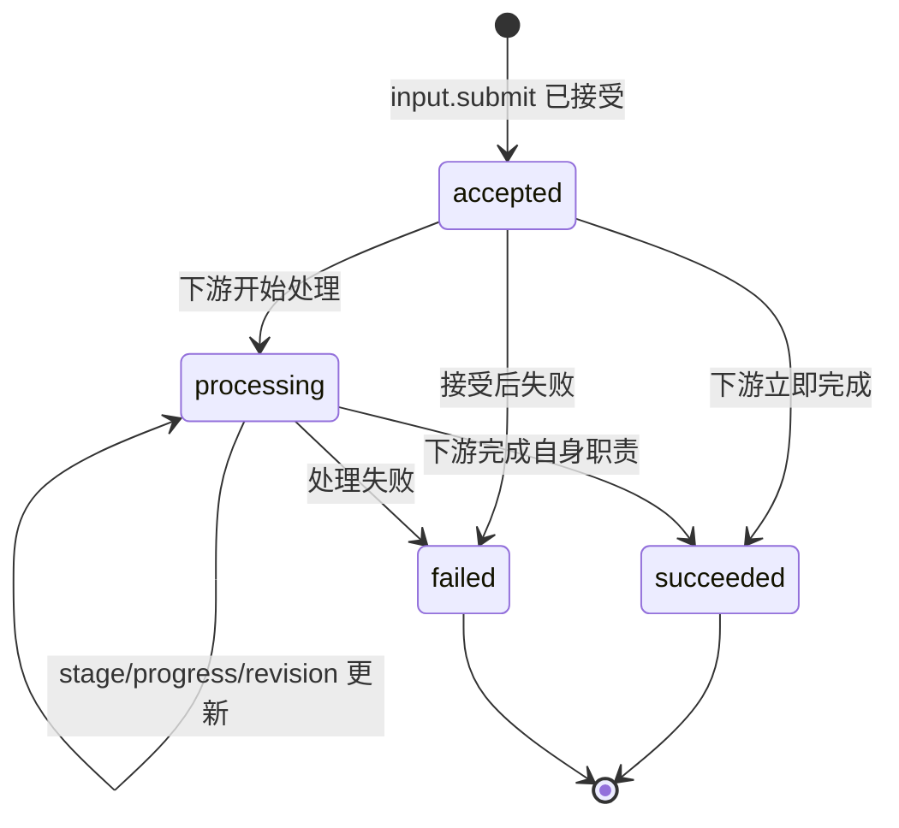
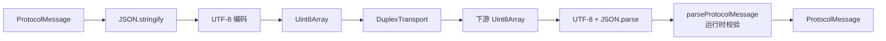

# @remote-copy/sdk

`@remote-copy/sdk` 是一个与前端框架和具体传输方式无关的远程输入 SDK。

SDK 在一个可靠、有序、保留消息边界的双工传输上运行统一协议。当前提供 `WebSocketTransport`；未来可以增加蓝牙 Transport，而不修改 `RemoteInputClient`、请求响应模型或状态事件模型。

## 快速开始

```ts
import {
  RemoteInputClient,
  SendInputError,
  WebSocketTransport,
} from "@remote-copy/sdk";

const client = new RemoteInputClient({
  clientName: "网页浏览器",
});

const unsubscribe = client.subscribe((state) => {
  console.log("连接状态：", state.connectionState);
  console.log("当前下游：", state.peer);
  console.log("当前操作：", state.currentOperation);
});

await client.connect(
  new WebSocketTransport("ws://127.0.0.1:17888/ws"),
);

try {
  const { operationId } = await client.sendInput("你好，Remote Copy");
  console.log("下游已接受操作：", operationId);
} catch (error) {
  if (error instanceof SendInputError) {
    console.error(error.code, error.message);
  }
}

unsubscribe();
await client.disconnect();
```

## 分层架构



不支持 Mermaid 的阅读环境可以参考下面的等价文本结构：

```text
页面或业务代码
      |
      v
RemoteInputClient        远程输入 API、operation 状态缓存和订阅
      |
      v
ProtocolSession          请求/响应关联、超时、事件流和会话握手
      |
      v
ProtocolCodec            协议报文与 Uint8Array 之间的编解码
      |
      v
DuplexTransport          可靠、有序、保留消息边界的双工管道
      |
      +-- WebSocketTransport
      |
      +-- 未来的 BluetoothTransport
```

每一层只关心自己的职责：

- `RemoteInputClient` 不知道 WebSocket、BLE、JSON 或分片。
- `ProtocolSession` 不知道数据通过哪种物理链路传输。
- `ProtocolCodec` 不管理连接和业务状态。
- `DuplexTransport` 不解析业务协议，也不理解输入命令。

依赖方向始终从上层抽象指向下层接口。具体 Transport 不得反向依赖 `RemoteInputClient`，Server 或 ESP32 也不会成为 SDK 的编译依赖。

## DuplexTransport

所有传输实现都必须遵守：

```ts
interface DuplexTransport {
  readonly kind: string;
  readonly state: TransportState;

  connect(): Promise<void>;
  disconnect(): Promise<void>;
  send(message: Uint8Array): Promise<void>;
  subscribe(listener: TransportListener): () => void;
}
```

传输层向上层交付完整的 `Uint8Array` 报文，并负责：

- 建立和关闭连接；
- 双向消息收发；
- 保留消息边界；
- 有序交付；
- 传输错误和断线通知；
- 传输特有的分片、重组和重试。

当前 `WebSocketTransport` 使用 WebSocket 二进制帧。未来蓝牙 Transport 应在内部处理 GATT、MTU、分片、ACK 和重试，协议层只接收重组后的完整报文。

### Transport 可替换拓扑



图中的实线是当前实现，虚线是未来扩展点。无论选择哪种 Transport，`ProtocolSession` 看到的始终是完整协议报文。

## 协议模型

协议运行在同一条持久双工管道上，包含三类报文：



这条时序中，Response 结束一次 request 生命周期；后续状态通过独立 Event 推送，不占用原请求。

```text
SDK                         下游
 |                           |
 |--------- Request -------->|
 |<-------- Response ---------|
 |                           |
 |<------ Status Event -------|
 |<------ Status Event -------|
```

所有报文都有版本和报文种类：

```ts
type ProtocolMessage =
  | RequestMessage
  | ResponseMessage
  | EventMessage;
```

当前协议版本是 `1`。

### Request

```json
{
  "v": 1,
  "kind": "request",
  "id": "req-123",
  "method": "input.submit",
  "body": {
    "text": "你好"
  }
}
```

### 成功 Response

```json
{
  "v": 1,
  "kind": "response",
  "id": "req-123",
  "ok": true,
  "body": {
    "operationId": "op-456"
  }
}
```

### 失败 Response

```json
{
  "v": 1,
  "kind": "response",
  "id": "req-123",
  "ok": false,
  "error": {
    "code": "input.rejected",
    "message": "输入请求被拒绝",
    "retryable": false
  }
}
```

### Event

```json
{
  "v": 1,
  "kind": "event",
  "name": "operation.status",
  "body": {
    "operationId": "op-456",
    "revision": 2,
    "state": "processing",
    "stage": "copying",
    "progress": 35,
    "message": "正在写入剪贴板"
  }
}
```

## requestId 与 operationId

协议刻意区分两种 ID。



三个生命周期互相独立：Transport 可以重试分片，但不能因此创建新的 operation；协议可以发起多个 request 查询同一个 operation。

### requestId

Request 的 `id` 是一次请求响应的关联 ID：

```text
Request(req-123) <-> Response(req-123)
```

`ProtocolSession` 内部使用它处理：

- 并发请求与响应关联；
- 请求超时；
- 错误 Response；
- 断线时拒绝未完成请求。

收到 Response 后，该 request 生命周期结束。SDK 的业务调用方通常不需要使用 requestId。

### operationId

`operationId` 标识一个可能持续较长时间的下游操作：

```text
input.submit Response
          |
          v
operationId = op-456
          |
          +-- operation.status revision 1
          +-- operation.status revision 2
          +-- operation.status revision 3
```

状态事件不携带最初的 requestId，只使用 operationId。

传输实现可能还需要自己的分片序号或 ACK 序号。传输序号、requestId 和 operationId 不得复用。

## 会话握手

Transport 连接后，`ProtocolSession` 自动发送：

```json
{
  "v": 1,
  "kind": "request",
  "id": "req-open",
  "method": "session.open",
  "body": {
    "clientName": "网页浏览器"
  }
}
```

下游响应协议版本、身份和能力：

```json
{
  "v": 1,
  "kind": "response",
  "id": "req-open",
  "ok": true,
  "body": {
    "protocolVersion": 1,
    "peer": {
      "id": "peer-1",
      "type": "server",
      "name": "Remote Copy Server"
    },
    "capabilities": {
      "methods": ["input.submit", "operation.get"],
      "events": ["operation.status", "session.peers"]
    }
  }
}
```

`client.connect()` 只有在 Transport 连接和 `session.open` 都成功后才 resolve。

## 发送输入

```ts
const { operationId } = await client.sendInput("需要发送的内容");
```

方法签名：

```ts
sendInput(text: string): Promise<{
  operationId: string;
}>;
```

Promise resolve 表示：

> 当前下游已经解析并接受 `input.submit`，并返回了可跟踪的 operationId。

它不表示固定的 Agent 已执行完成。当前下游可能是直接执行输入的 Server，也可能是只负责转发的设备。后续状态代表当前协议下游对该操作的处理情况。

`SendInputError.code` 包含：

| 错误码 | 含义 |
| --- | --- |
| `input-empty` | 输入内容为空 |
| `transport-not-ready` | Transport 或协议会话尚未就绪 |
| `input-unsupported` | 当前下游没有声明 `input.submit` 能力 |
| `input-busy` | 上一个输入操作仍处于活动状态 |
| `request-failed` | 请求超时、传输失败或下游返回错误 Response |

## 操作状态

公共状态只定义与具体下游无关的 `state`：

```ts
type OperationState =
  | "accepted"
  | "processing"
  | "succeeded"
  | "failed";
```

具体处理阶段通过 `stage` 表达：

```text
WebSocket Server：queued / copying / pasting / done
未来 ESP32：     received / forwarding / forwarded
```

`succeeded` 的含义是“当前下游已完成它在当前协议中的职责”，不自动表示某个未知的最终 Agent 已执行。



`stage` 不参与公共状态机约束。当前 Server 可以依次报告 `queued -> copying -> pasting -> done`，未来 ESP32 可以报告 `received -> forwarding -> forwarded`。

每次状态更新都包含递增的 `revision`。SDK 会忽略旧 revision，防止重复通知或旧状态覆盖新状态。

## 获取操作状态

### 订阅全部 SDK 状态

```ts
client.subscribe((state) => {
  console.log(state.currentOperation);
});
```

Transport 断开或进入错误状态后，SDK 会清空当前会话的 `peer`、`capabilities` 和 `peers`。operation 缓存和 `currentOperation` 会保留，断线后仍可通过本地 API 读取最后收到的操作状态。

### 读取本地缓存

```ts
const status = client.getOperationStatus(operationId);
```

该方法只读取 SDK 最近收到的状态，不访问下游。

### 订阅单个操作

```ts
const unsubscribe = client.subscribeOperation(
  operationId,
  (status) => {
    console.log(status.state, status.stage, status.progress);
  },
);
```

### 主动刷新

```ts
const status = await client.refreshOperationStatus(operationId);
```

这会发送 `operation.get` 请求，适合重连恢复或手动刷新。正常连接期间应优先使用 `operation.status` 推送，不建议固定间隔轮询。

## 编码

当前 `JsonProtocolCodec` 使用：



非法 UTF-8、JSON 语法错误和协议结构错误都会作为协议校验错误报告；`RemoteInputClient` 将这类错误统一映射为 `invalid-message`。

```text
ProtocolMessage
      -> JSON.stringify
      -> UTF-8
      -> Uint8Array
      -> DuplexTransport
```

协议类型和运行时校验位于 `@remote-copy/shared`。SDK 与 Server 都必须通过 `parseProtocolMessage` 校验收到的未知数据。

未来可以实现其他 Codec，但同一会话的双方必须使用相同编码。更换 Codec 不应影响 `RemoteInputClient` 或 Transport 接口。

## 新增 Transport

未来实现蓝牙或其他 Transport 时：

1. 实现 `DuplexTransport`。
2. 向上层交付完整 `Uint8Array` 报文。
3. 在内部处理连接、权限、分片、重组、ACK 和重试。
4. 不解析 `session.open`、`input.submit` 或 `operation.status`。
5. 不创建或修改 operationId。
6. 不向 `RemoteInputClient` 暴露 BLE 或 WebSocket 对象。

只要下游实现相同协议，SDK 上层不需要知道当前使用的是 WebSocket 还是蓝牙。

## 开发与验证

```bash
pnpm check:sdk
pnpm build:sdk
pnpm test:sdk
```

跨协议、SDK、Server 或网页的修改应运行：

```bash
pnpm test:sdk
pnpm check
pnpm build
```
